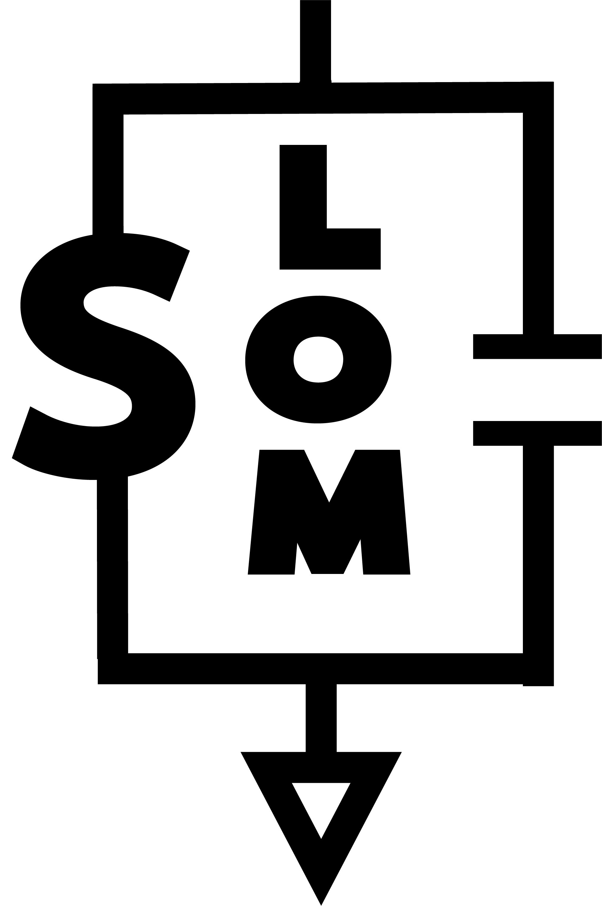

<p align="center">
  
</p>

# simpleLOMs

**Simple Lumped Oscillator Models** for superconducting quantum device design.

In superconducting quantum device design, finite element electromagnetic (FEM) simulations are required throughout the design process. These are both computationally intensive and time-consuming. **Lumped oscillator models (LOMs)** allow for modular FEM simulations of superconducting device designs that can then be combined in an effective circuit model. These lumped circuit models are easily translated into circuit Hamiltonians.

In this package we provide several **Lumped oscillator models (LOMs)** of superconducting coplanar waveguides for use in circuit quantization.


## Installation

Install from [PyPI](https://pypi.org/project/simpleLOMs/):

```bash
pip install simpleLOMs
```

Or install from source:

```bash
git clone https://github.com/elizabethkunz/simpleLOMs.git
cd simpleLOMs
pip install -e .
```

See the [documentation](https://elizabethkunz.github.io/simpleLOMs/) for full installation options and dependencies.

## Documentation

Full documentation is available at: **https://elizabethkunz.github.io/simpleLOMs/**

Documentation is built with Sphinx and deployed via GitHub Actions. 

- [Installation](https://elizabethkunz.github.io/simpleLOMs/install.html)
- [API Reference](https://elizabethkunz.github.io/simpleLOMs/api.html)
- [Tutorials](https://elizabethkunz.github.io/simpleLOMs/tutorials/index.html)

## License

This project is licensed under the MIT License — see the [LICENSE](LICENSE) file for details.

## Citation

If you use this software in your research, please cite it using the metadata in [CITATION.cff](CITATION.cff) or the instructions in the [documentation](https://elizabethkunz.github.io/simpleLOMs/).
