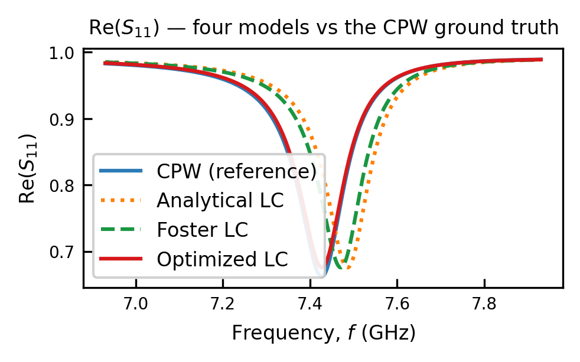
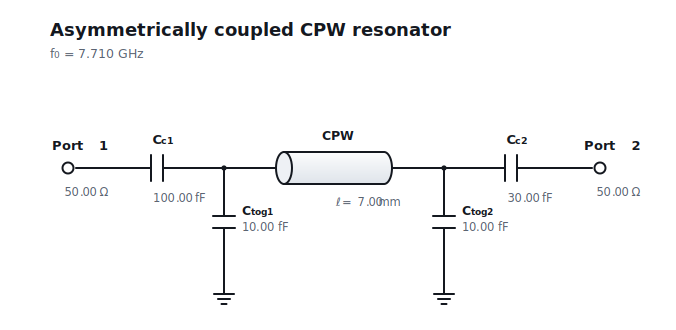
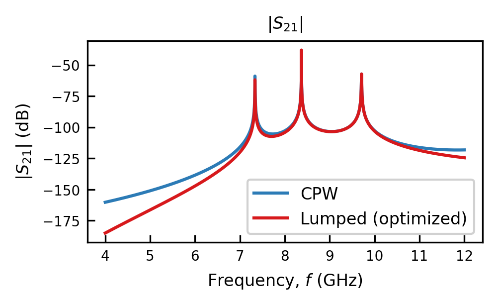
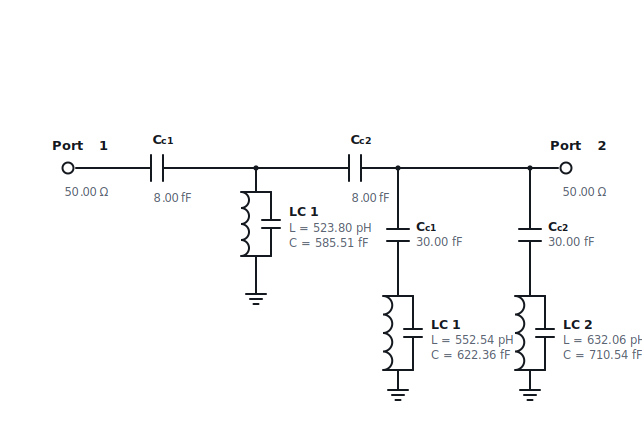
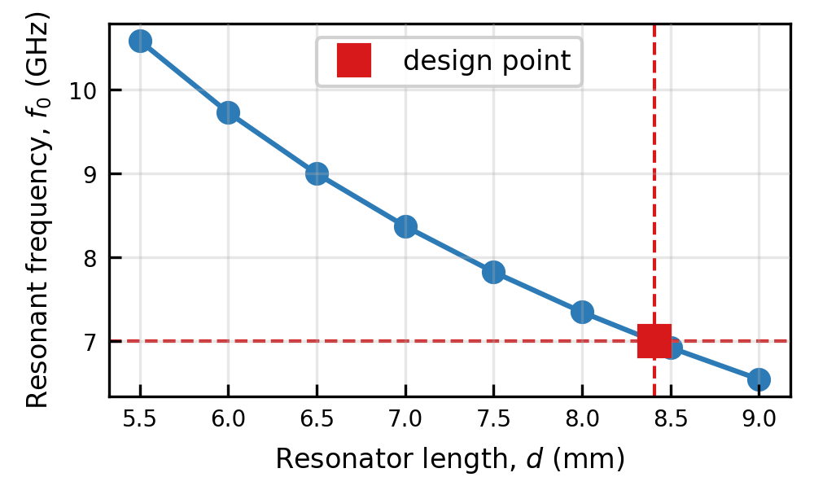
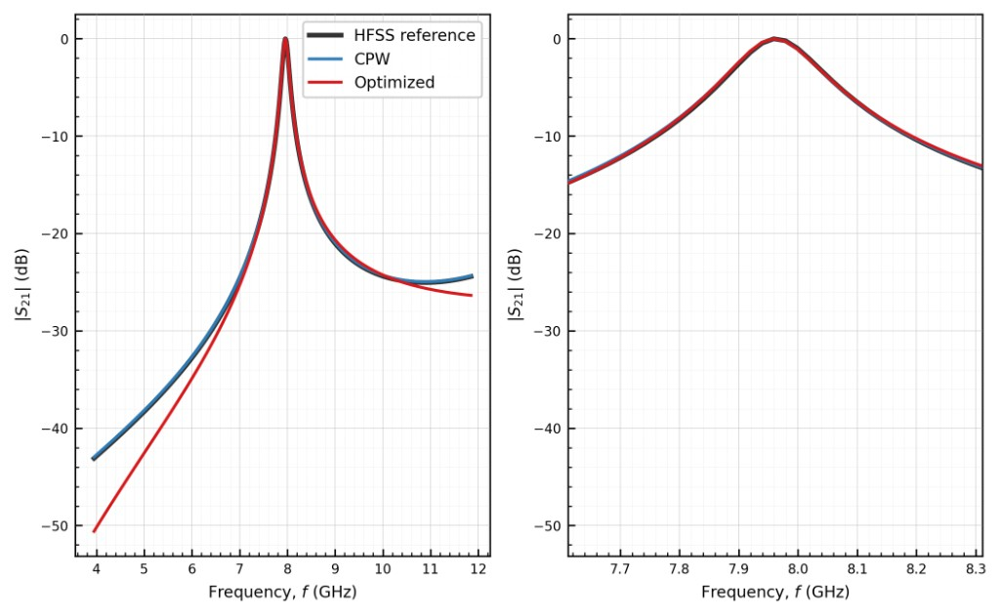

.. .. image:: _static/logo.png
..    :align: center
..    :width: 150px
..    :class: hero-logo

simpleLOMs
==========

.. rst-class:: lead

   Lumped oscillator models for superconducting quantum circuits.

The **simpleLOMs** package allows you to quickly generate lumped oscillator models
of distributed resonators, and directly integrate them into your circuit design.

Functionality
-------------

Lumped oscillator models
^^^^^^^^^^^^^^^^^^^^^^^^

The **simpleLOMs** package provides a single interface to
three different lumped oscillator models (LOMs) of a coplanar-waveguide (CPW) resonator. The optimized method is the default method and is the most accurate,
as it accounts for the loading on both ends of the resonator. The other two methods are
faster but less accurate, and are provided for comparison and convenience.

Every lumped model is fit through the same :func:`~simpleLOMs.fit_lom` call and returns
an effective ``(L, C)`` you can reuse across a coupling sweep:

- **Optimized** — loading-aware and most accurate
- **Foster** — a simple closed form expression commonly used in Black Box Quantization
- **Analytical** — a closed form expression relying on the bare resonance $f_0$

   Transmission through a strongly asymmetrically coupled resonator. The
   optimized LOM sits on top of the full-wave reference, while the closed-form
   estimate is off by roughly 0.75 GHz, as described in
   :doc:`Tutorial 1 <tutorials/01_fit_lc_models>`.

You can create and view circuit-level designs, both using distributed lumped elements and
using schematics both of the modular lumped designs.

   A CPW resonator reduced to lumped elements made using the **simpleLOMs** schematic feature. Learn how to do this for 

Modular network design
^^^^^^^^^^^^^^^^^^^^^^

Larger networks can also be split into subsystems containing a single
distributed element and analyzed. Optimized lumped models can be fit to individual elements in a larger network, and then recombined to form a complete network model.

This allows you to quickly analyze large networks of resonators without having to fit the entire network at once.

   Fit of a network containing three distributed resonators, as described in
   :doc:`Tutorial 3 <tutorials/03_resonator_networks>`.

These larger networks can also be easily visualized and exported to a schematic representation,
with the fitted lumped element models replacing the distributed elements.

   Fitted lumped element models of a network containing both inline and hanging resonators, as described in
   :doc:`Tutorial 9 <tutorials/09_hybrid_series_hanger>`.

Design optimization
^^^^^^^^^^^^^^^^^^^

**simpleLOMs** also provides a simple interface to optimize the design of a resonator to hit a target frequency
and loaded quality factor using circuit-level models.
This is done by sweeping the resonator length and coupling capacitance, as described in
:doc:`Tutorial 7 <tutorials/07_design_to_spec>`.

   Resonant frequency versus resonator length. The design point marks the
   length chosen to hit a target frequency of 7 GHz, as described in
   :doc:`Tutorial 7 <tutorials/07_design_to_spec>`.

Integration with FEM and Touchstone files
^^^^^^^^^^^^^^^^^^^^^^

The **simpleLOMs** package uses `scikitrf` which can natively read Touchstone files generated from full-wave simulations or measurement.
This allows you to compare and quickly validate  the lumped oscillator models against full-wave simulations or measured data.

   Comparison of a lumped oscillator model against a full-wave simulation, generated using ANSYS HFSS, 
   as shown in :doc:`Tutorial 5 <tutorials/05_compare_to_simulations>`.

Citation
--------

If you use **simpleLOMs** in your research, please cite:

   Elizabeth Kunz and Eli Levenson-Falk,
   *Simple, rapid black box quantization for superconducting quantum circuits*
   (2026).

See :doc:`citation` for BibTeX and machine-readable ``CITATION.cff`` metadata.

Quick links
-----------

- :doc:`Installation <install>`
- :doc:`Tutorials <tutorials/index>`
- :doc:`API reference <api>`
- :doc:`Citation <citation>`

Quick start
-----------

New here? Start with :doc:`install`, then walk through
:doc:`tutorials/01_fit_lc_models`. The figures on this page are regenerated by
``notebooks/generate_docs_figures.py``.

.. code-block:: python

   import skrf as rf
   from simpleLOMs import CPWParams, fit_lom

   cpw  = CPWParams(ep_r=11.45)
   freq = rf.Frequency(4e9, 12e9, 8001, unit="Hz")

   # Effective L, C for a 7 mm resonator
   L, C = fit_lom(7e-3, model="optimized",
                  Cc1=100e-15, Cc2=30e-15,
                  Ctog1=10e-15, Ctog2=10e-15,
                  cpw_params=cpw, freq=freq)

.. toctree::
   :maxdepth: 2
   :caption: Documentation
   :hidden:

   install
   tutorials/index
   api
   citation
   release_logs

.. toctree::
   :caption: References
   :hidden:

   GitHub <https://github.com/elizabethkunz/simpleLOMs>
   LFL Lab ✌️ <https://dornsife.usc.edu/lfl/>
